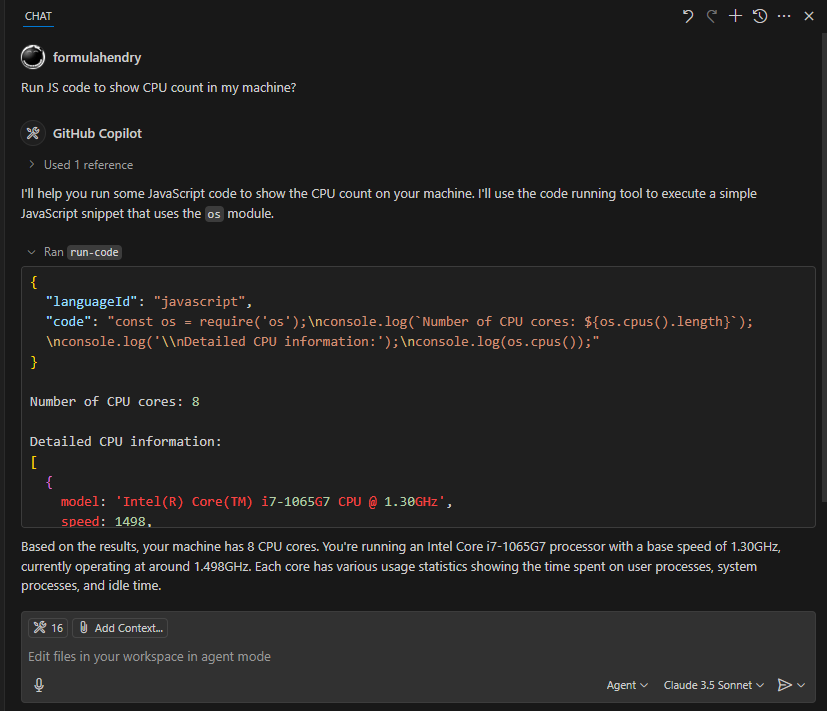

# Code Runner MCP Server for VS Code

Zero setup to use [Code Runner MCP Server](https://www.npmjs.com/package/mcp-server-code-runner) in VS Code for running code snippet and show the result.

## Requirements

VS Code version >= `1.100`

## Features

Run code in Agent mode:

## For more information

* [Code Runner MCP Server](https://github.com/formulahendry/mcp-server-code-runner/)
* [Build your own MCP Server](https://github.com/formulahendry/generator-mcp)
